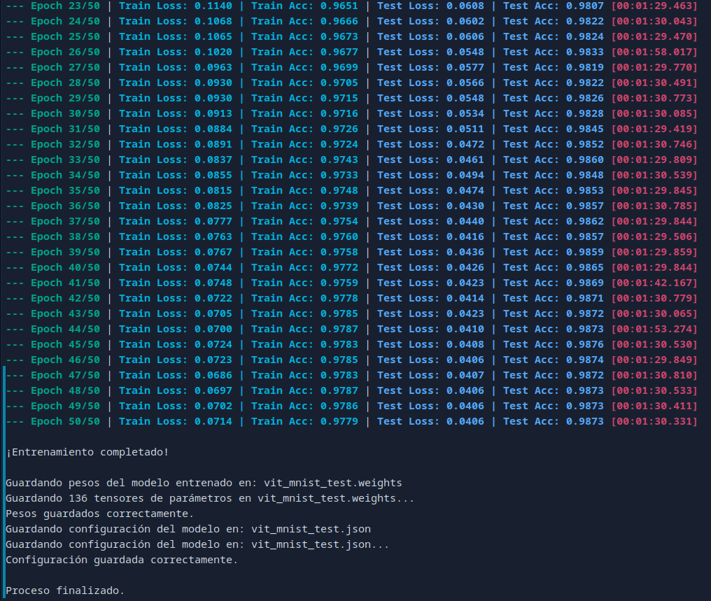
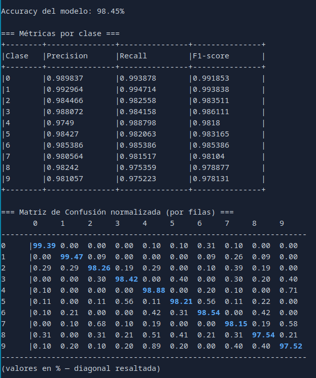

# Vision Transformer in CUDA

## Requisitos

| **Herramienta** | **Usado**       | **Recomendado** |
| --------------- | --------------- | --------------- |
| **CMake**       | 3.30.5          | ≥ 3.26          |
| **G++ (GCC)**   | 13.3.1          | 13.x            |
| **CUDA (nvcc)** | 12.6 (V12.6.85) | 12.0 o superior |

## Instrucciones para ejecutar el proyecto

### 1. Clonar repositorio, Descargar y descomprimir los datos

```bash
git clone https://github.com/PaulParizacaMozo/VisionTransformer.git
cd VisionTransformer
cd cuda_Vit
```

El proyecto utiliza un archivo comprimido llamado `data.zip` que contiene los conjuntos de datos necesarios para la ejecución (Fashion MNIST y MNIST).

1. Descarga el archivo `data.zip` desde el repositorio.
2. Descomprime el archivo `data.zip` en el directorio raíz de tu proyecto. Esto creará un directorio `data` que contiene los siguientes archivos CSV:
   - `fashion_test.csv`
   - `fashion_train.csv`
   - `mnist_test.csv`
   - `mnist_train.csv`

```bash
wget https://github.com/PaulParizacaMozo/VisionTransformer/releases/download/data/data.zip
7z x data.zip
```

### 2. Preparar el script `run.sh`

Antes de ejecutar el script, asegúrate de darle permisos de ejecución:

```bash
chmod +x run.sh
```

### 3. Ejecutar el proyecto

- Para ejecutar el entrenamiento:

```bash
./run.sh
```

- Para testear el modelo en el conjunto de pruebas:

```bash
./run.sh test
```

- Para testear el modelo con una imagen aleatoria `.png`:

```bash
./run.sh image data/7.png
```

---

## Resultados

### Dataset: MNIST

Este experimento entrena un modelo Vision Transformer (ViT) en el dataset **MNIST** usando los siguientes hiperparámetros:

#### **1. Hiperparámetros del Modelo**

| Parámetro        | Valor | Comentario                                   |
| ---------------- | ----- | -------------------------------------------- |
| `embedding_dim`  | 96    | Dimensión de embedding (recomendado: 96–196) |
| `num_layers`     | 8     | Capas Transformer Encoder                    |
| `num_heads`      | 8     | Cabezas de atención multihead                |
| `patch_size`     | 14    | Tamaño del parche (patch)                    |
| `num_classes`    | 10    | MNIST tiene 10 clases (0–9)                  |
| `in_channels`    | 1     | Canal único (imágenes en escala de grises)   |
| `mlp_hidden_dim` | 384   | `embedding_dim * 4`                          |
| `dropout_rate`   | 0.2   | Regularización                               |

#### **2. Hiperparámetros de Entrenamiento**

| Parámetro       | Valor | Comentario                                 |
| --------------- | ----- | ------------------------------------------ |
| `epochs`        | 50    | Número total de épocas                     |
| `batch_size`    | 128   | Tamaño de batch                            |
| `learning_rate` | 3e-4  | Tasa de aprendizaje inicial                |
| `weight_decay`  | 1e-4  | Regularización L2                          |
| `lr_init`       | 3e-4  | Tasa inicial de LR (igual a learning_rate) |
| `warmup_frac`   | 0.1   | 10% de las épocas serán warm-up            |

#### **3. Configuración de Datos**

| Parámetro         | Valor          | Comentario                        |
| ----------------- | -------------- | --------------------------------- |
| `sample_frac`     | 1.0            | Se usa el 100% del dataset MNIST  |
| `train_frac`      | 0.80           | 80% para entrenamiento            |
| `val_frac`        | 0.20           | 20% para validación               |
| `num_channels`    | 1              | Escala de grises                  |
| `height`, `width` | 28 × 28        | Tamaño original de imagen         |
| `mean`, `std`     | 0.1307, 0.3081 | Normalización estándar para MNIST |

#### Ejecucion

- **Entrenamiento:**

  

- **Test:**

  

#### Modelo Preentrenado

El modelo ya ha sido entrenado y se encuentra guardado en:

```
models/vit_mnist_test
```

Para probarlo simplemente ejecuta:

```bash
./run test
```
